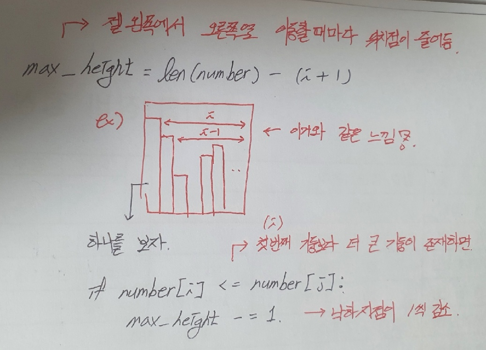
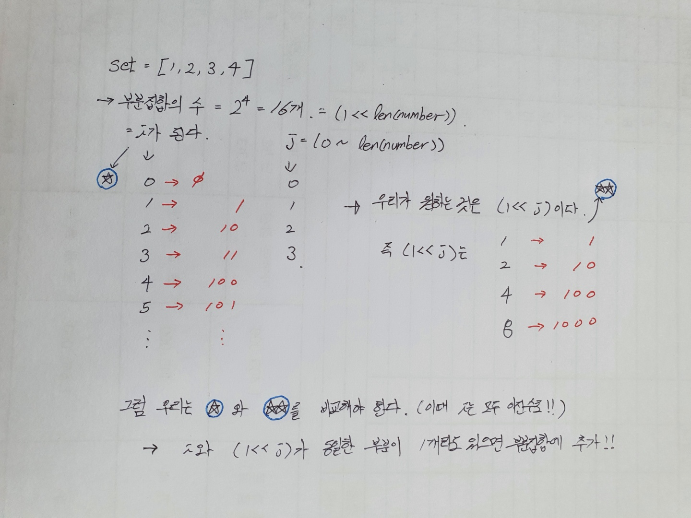
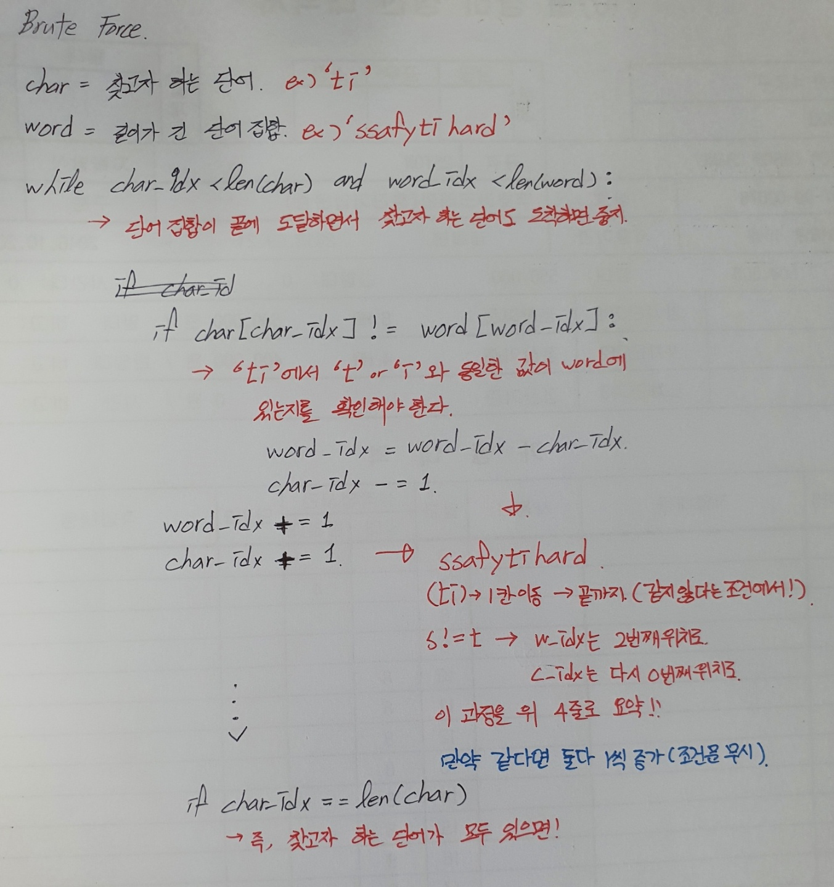

# Algorithm

## List 1

### 연습문제 1 - Gravity

```python
N = int(input())
    number = list(map(int, input().split()))
    # print(number)

    # 최종 결과값
    result = 0

    # 전체 리스트 순회
    for i in range(N):
        # i 번째 최대 낙차 값
        max_height = len(number) - (i + 1)

        # i 다음 행부터 박스 끝까지 반복
        for j in range(i+1, len(number)):
            # i보다 j가 더 큰 경우 최대 낙차값 -1
            if number[i] <= number[j]:
                max_height -= 1
            
        # 최종 최대 낙차값 도출
        if result <= max_height:
            result = max_height
```



- 꼭 배열로 나열할 필요는 없다!
- 규칙을 찾아서 구현을 해보자!


### 1206

```python
# 범위에서 앞 뒤 2칸 제외
    for i in range(2, N-2):
        # 각 층간의 높이 차이 중, 가장 차이가 적은 값
        minimum = 246
        # 현재 위치를 기준으로 앞 뒤 2칸씩 봐야함으로 범위 5 지정
        for j in range(5):
            if j != 2:  # 현재 내 위치에서는 비교가 불가능!
                # 현재 내위치의 2칸 앞부터 차례대로 5번씩 계산
                if data[i] - data[i - 2 + j] < minimum:
                    minimum = data[i] - data[i - 2 + j] # 계속해서 갱신

        # 그 차이가 양수면 최종 결과값으로 저장
        if minimum > 0:
            result += minimum
```

- 현재 내 위치에서 비교가 불가능한점 체크!!


### 전기 버스

```PYTHON
while now < N:
        # 이동했을 때 충전소에 있으면
        if now in station:
            # 충전횟수 1늘리고 현재위치를 충전소위치로 변경
            # 충전한 직전위치도 현재 위치로 변경
            count += 1
            charge = now
            now += K
        # 충전소가 없으면 현재위치를 1씩 빼면서 충전소 찾기
        else:
            now -= 1

        # 충전소를 못찾았으면 == 직전 충전한 위치까지 도달하면
        if charge == now:
            # 충전을 더는 못하니깐 0을 반환하며 멈춤
            count = 0
            break
```

* while문을 쓰면서 푸는걸 생각하기!!
* 충전소를 못찾은 경우 1씩 빼면서 조건을 만족하는지 여부 확인하기!!


### 카드

```python
card = list(map(int, input()))

    # 카드 수 카운트용 리스트 생성 (0 ~ 9)
    card_list = [0]*10

    # 카드 수 카운팅
    for i in card:
        card_list[i] += 1

    # 반복문 인덱스
    idx = 0
    # 제일 큰 카드의 위치
    max_idx = 0

    while idx != 10:    # 범위는 카드 리스트가 10개기 때문에
        # 크거나 같다로 표현하여 가장 뒤에 있는 값을 추출!
        if card_list[idx] >= card_list[max_idx]:
            max_idx = idx
        idx += 1
    print(max_idx, card_list[max_idx])
```

- 크기비교할때 크거나 같다로 표현하여 같은 수인 경우 뒤에 인덱스 들고오게하기!!


### 구간합

```python
    # 가장 작은수 0 지정
    maximum = 0
    # 가장 큰수인 10000이 3번 나오는 경우로 지정
    minimum = 10001 * M

    # 전체 길이에서 (M-1)을 뺀만큼 범위 지정
    for i in range(N-M+1):
        # M개의 수의 합을 담을 임시값
        sub = 0
        # i부터 M개까지의 값을 전부 합한다.
        for j in range(i, i+M):
            sub += data[j]
        
        # 그 값을 계속해서 비교하기
        if sub > maximum:
            maximum = sub
        if sub < minimum:
            minimum = sub

    print(maximum - minimum)
```

- 반복문에서 범위 지정 신경쓰기!
- max와 min을 비교할때는 각각의 if문 사용!


### flatten

```python
def search(data):
    max_V = [data[0], 0]
    min_V = [data[0], 0]
    # 최댓값과 최소값의 위치와 해당하는 값 추출하는 함수 생성
    for i in range(len(data)):
        if data[i] > max_V[0]:
            max_V[0], max_V[1] = data[i], i
        if data[i] < min_V[0]:
            min_V[0], min_V[1] = data[i], i

    return max_V, min_V
```

- 해당하는 데이터(리스트)에서 최댓값과 최솟값의 위치와 값을 추출하는 함수 생성


```python
max_V, min_V = search(data)
    # 총 상자를 다 이동시키면서 최댓값과 최솟값의 차이가 1이상인 경우
    while n and abs(max_V[0] - min_V[0]) > 1:
        # 최댓값에 존재하는 상자를 최솟값의 위치로 이동
        data[max_V[1]] -= 1
        data[min_V[1]] += 1
        n -= 1
        max_V, min_V = search(data)
```

- 조건 주어주는 부분 확실하게 이해하기!!!


## List2

### 연습문제1

```python
# 값을 채워넣을 행렬 생성
    matrix = [[0] * N for _ in range(N)]

    # 우하좌상의 순서로 방향벡터 설정
    di = [0, 1, 0, -1]
    dj = [1, 0, -1, 0]

    for i in range(N):
        for j in range(N):
            for k in range(4):
                # 우하좌상 4가지 방향 모두 고려
                ni = i + di[k]
                nj = j + dj[k]
                # 4가지 방향으로 이동했을 때 행렬안에 존재하는 값만 추가
                if 0 <= ni < N and 0 <= nj < N:
                    matrix[i][j] += abs(number[i][j] - number[ni][nj])

```

- 방향벡터 설정하는것!!!
- 방향벡터에 맞게 새로운 i와 j값 지정
- 조건에 부합하는 값만 matrix 해당 인덱스에 저장

```python
def search(x, y, n):
    result = 0
    for k in range(4):
        nx = x + di[k]
        ny = y + dj[k]
        if 0 <= nx < n and 0 <= ny < n:
            result += abs(number[x][y] - number[nx][ny])
    return result
```

- 위와 같은 방법을 통해 함수형태로 만들어 사용가능한 점도 참고하자!!!


### 연습문제 2 - 부분집합

```python
# 이 부분 확실하게 외우기
    for i in range(1, 1<<len(number)):
        tmp = 0
        for j in range(len(number)):
            if i & (1<<j):
                tmp += number[j]
        if tmp == 0:
            result = 1
            break
    if result == []:
        result = 0
    print('#{} {}'.format(tc, result))
```




### 연습문제 3 - Snail

```python
    # 값을 채워넣을 0으로 이루어진 array 생성
    data = [[0]*N for _ in range(N)]

    # 방향벡터
    dx = [0, 1, 0, -1]
    dy = [1, 0, -1, 0]

    # while문 종료 조건이면서 채워넣을 값
    cnt = 1
    i = 0
    j = -1
    # 방향벡터의 인덱스
    k = 0

    # 모든 행렬을 다 돌아다닌 경우 종료
    while cnt <= N*N:
        nx = i + dx[k]
        ny = j + dy[k]
        # 벽을 만나거나 이미 존재하는 수를 만나면 안된다는 조건!!
        if 0 <= nx < N and 0 <= ny < N and data[nx][ny] == 0:
            data[nx][ny] = cnt
            cnt += 1
            # i와 j에 현재 위치를 계속해서 바꿔주는거 잊지말자!!
            i, j = nx, ny

        # k값이 아무리 커져도 0,1,2,3에서 놀아야하기 때문에 이렇게 지정
        else:
            k = (k+1)%4
```

- 새로운 행렬을 생성하는 것을 잊지말기!
- while문에 넣을 변수 지정하는 것! 중요하게 생각하기!!
- 반복문 종료 조건 및 조건문 생성 확실하게 이해하기!!

- k의 범위 역시 기억하자!


### 1209 합 구하기

```python
	# 행의 합
    result1 = 0
    # 열의 합
    result2 = 0
    # 정대각선의 합
    result3 = 0
    # 역대각선의 합
    result4 = 0
```

- 모든 구할 값들을 생성

```python
for i in range(100):
        # 계속해서 만들어지는 행의 합과 열의합의 초기화
        sub_1 = 0
        sub_2 = 0
        for j in range(100):
            sub_1 += data[i][j]
            sub_2 += data[j][i]
        if sub_1 > result1:
            result1 = sub_1
        if sub_2 > result2:
            result2 = sub_2
    
        # 대각선의 합 구해보자
        result3 += data[i][i]
        result4 += data[i][99-i]
```

- 반복문을 사용해서 각각의 상황에 맞게 값들을 추가하는 방법 배우기!!


### Binary Search

```python
def binarySearch(data, key):
    start = 0
    # 가장 끝에 있는 위치 바로 직전까지 이동(why? => idx이기 때문)
    end = len(data)-1
    while start <= end:
        middle = (start + end) // 2
        if data[middle] == key:
            return True
        elif data[middle] > key:
            end = middle - 1
        else:
            start = middle + 1
    return False

data = [1, 3, 5, 7, 9, 11, 13, 15, 17, 19, 21]
print(binarySearch(data, 5))
```

- 이진탐색이 뭐냐? => 범위를 계속해서 반으로(middle) 나눠주면서 
  그 범위를 조정하고 그 범위안에 있는 값을 탐색!!

- 위의 방법은 시작점과 끝점을 계속해서 1씩 더해주거나 빼주면서 범위를 줄여나간다.


```python
def binarySearch(p, key):
    start = 1
    end = p
    count = 0
    while start <= end:
        middle = (start + end) // 2
        if middle == key:
            return count
        elif middle > key:
            end = middle
        else:
            start = middle
        count += 1

```

- 위의 방법은 시작점과 끝점을 계속해서 중간값으로 교체해주면서 범위를 줄여나간다.
- 어떻게든 같은 형태를 유지하면서 부수적인 요소만 변경해줌으로써 구현이 가능한점!! 숙지!!!


### 색칠하기

```python
# data = [[2, 2, 4, 4, 1], [3, 3, 6, 6, 2]]
    for info in data:
        r1, c1, r2, c2, c = info	# 중요!!
        for i in range(r1, r2+1):
            for j in range(c1, c2+1):
                paper[i][j] += c
                if paper[i][j] == 3:
                    result += 1
    print('#{} {}'.format(tc, result))
```

- 처음 for문에서 data[0]와 data[1]에 존재하는 값들을 한번에 지정해주는 것 숙지!!

- 밑에 조건을 확실하게 맞추면서 구현하기!


### 특별한 탐색

```python
for i in range(len(data)):
        # max값 처음 지정 & 그 인덱스 지정
        max_V = data[i]
        max_idx = i
        # min값 처음 지정 & 그 인덱스 지정
        min_V = data[i]
        min_idx = i
        # i 이후의 값들과 비교하면서 max값과 min값 변경
        for j in range(i, len(data)):
            if max_V <= data[j]:
                max_V, max_idx = data[j], j
            if min_V >= data[j]:
                min_V, min_idx = data[j], j

        # 길이가 홀수와 짝수일 때 차이가 존재하는지에 따라 다르게 지정
        if i % 2:
            data[i], data[min_idx] = data[min_idx], data[i]
        else:
            data[i], data[max_idx] = data[max_idx], data[i]
```

- 구현에 중요한점!! 

  - 반복문 안에서 어느 위치에 계속 초기화 시킬 값을 지정할 것인가?
  - 여기에서는 max, min을 i는 변할때만 변경시켰다!!
  - 이렇게 어느 위치에 그 변수를 할당할건지 생각을 꼭 해봐야한다.

  

- 길이가 홀수일때와 짝수일때마다 값이 달라지는 문제가 존재할 수 있기 때문에 알아보자!!


### 사다리

```python
# 아래로 내려갈 일이 없기 때문에 방향벡터는 3개만 지정
dx = [-1, 0, 0]
dy = [0, -1, 1]

# 방향벡터와 조건문을 사용하면서 원하는 열의 인덱스를 추출하는 함수 생성
def search(x, y):
    visited = [[0]*100 for _ in range(100)]
    visited[x][y] = 1
    while x != 0:
        for i in range(3):
            # 이동한 위치를 nx, ny로 새롭게 지정해준다.
            nx = x + dx[i]
            ny = y + dy[i]
            if 100 > nx >= 0 and 100 > ny >= 0 and visited[nx][ny] == 0 and data[nx][ny] == 1:
                # 조건을 만족하면 이동한 위치를 1로 지정하며 현재위치로 갱신
                visited[nx][ny] = 1
                x = nx
                y = ny
    return y
```

- 방향벡터를 필요에 따라 변경해주는 것도 숙지!
- 가장 중요한 부분은 어디서 시작해서 어디로 끝나는지를 계속해서 되새김질하기!

- 자기가 지나온 부분을 깔끔하게 할 필요의 여부 빠르게 확인 후 조치!!
  - 조치가 더 빠른지 이동한 위치를 현재위치로 변경하는게 빠른지 순서 확인 후 작성
  - (여기에서는 1로 변경 이후 이동한 위치를 현재위치로 변경)
  - Why?? => 그러면 이동하기 전에 이미 이동할 자리가 1이 되기 때문에 조건문 망가짐!!!


## String

### 연습문제 1 - 문자열 뒤집기

```python
for tc in range(1, T+1):
    word = input()
    # 1번. [::-1] 같이 슬라이싱을 사용하자.
    print('#{} {}'.format(tc, word[::-1]))

    # string에 존재하는 함수인 reversed 를 사용하자.
    result = list(reversed(word))
    print('#{} {}'.format(tc, ''.join(result)))

    # 반복문을 통해 result 앞에 계속해서 추가해주자 (+ 사용)
    result = ''
    for i in word:
        result = i + result
    print('#{} {}'.format(tc, result))
```

- 문자열도 리스트와 다르지 않다는 것을 깨닫자!
- 서로 사용가능한 함수의 종류가 다른거지 인덱스로 접근하는 걸 포함해 비슷한 부분이 상당히 많다!!
- 뒤집은 문자열에 접근할 수 있는 3가지 방법 모두 숙지해놓자!
  - why? => 언제 어떤 방법이 더 편할 수 있는지 알 수가 없기 때문이다!!


### 연습문제 2 

```python
# 결국 문자열과 리스트의 차이는 없다!!
result = ''

# 아래와 같은 값을 왜 지정해주었냐?? ==> 음수 양수 여부 확인 및 조치를 위해
is_negative = False

# 음수인 경우 바꿔준다!!
if word < 0:
    word = word * -1
    is_negative = True

while word > 0:
    result = chr(word % 10 + 48) + result
    word = word // 10

# if문 다음에 아래와 같이 조건을 안써준거는 묵음형태다 (is_negative:) = (is_negative==True:)
if is_negative:
    result = '-' + result
```

- 상황에 따라서 변경시켜줄 변수를 지정하는 것을 제대로 알아야 한다!!
- 조건문에 사용되는 조건도 확실한 이해 필요!!


### 연습문제 3 - Brute Force(String with 고지식한 패턴)

```python
def bruteForce(char, word):
    word_idx = 0
    char_idx = 0
    count = 0
    while char_idx < len(char) and word_idx < len(word):
        if word[word_idx] != char[char_idx]:
            word_idx = word_idx - char_idx
            char_idx = -1
        word_idx += 1
        char_idx += 1
        if char_idx == len(char):
            count += 1
            char_idx = 0
    return count
```




### 연습문제 4 - GNS

```python
# 제환된 리스트에서 원하는 값들 추출하는 방법!! 중요하다!!
numbers = ["ZRO", "ONE", "TWO", "THR", "FOR", "FIV", "SIX", "SVN", "EGT", "NIN"]

result = ''
for number in numbers:
    for word in words:
        if word == number:
            result += word + ' '
```

- List와 string에서 중요한 방법은 전체 리스트에서 원하는 값을 추출하는 것이다.
  - 예를 들어 알파벳은 26개가 존재하고 숫자는 10개가 존재한다.
  - 위의 예시 또한 숫자의 문자화로 10개가 존재함을 알 수 있다
  - 이러한 제한된 존재의 값을 리스트에 저장한 이후 반복문과 조건문을 통해 인덱스로 추출!!! (접근 용이)


### 문자열 비교

```python
# 최종 결괏값
    result = 0
    # 전체 길이 - 패턴 길이 만큼 순회
    for i in range(len(long)-len(short)+1):
        # 전체 길이중, 현재 위치부터 패턴길이까지 슬라이싱 한 값이
        # 패턴과 동일 하다면
        if long[i:i+len(short)] == short:
            # 1로 변환 후 종료
            result = 1
            break

```

- 완전 탐색으로 모든 인덱스를 다 돌리면서 확인하는 방법도 있다.


```python
def search(short, char):
    for i in range(len(short)-2, -1, -1):
        if short[i] == char:
            return len(short)-i-1
    return len(short)

def boyer_moore(short, long):
    n = len(short)
    m = len(long)
    idx = 0
    while idx <= m-n:
        j = n-1
        while j >= 0:
            if short[j] != long[idx+j]:
                move = search(short, long[idx+n-1])
                break
            j -= 1
        if j == -1:
            return 1
        else:
            idx += move
    return 0
```

- 보이어 무어 방법을 통한 텍스트 탐색 방법 확인해보기


### 글자 수

```python
for char in long:
    if char in short:
        case[char] = case.get(char, 0) + 1

result = 0
for num in case.values():
    if result < num:
        result = num
```

- 간단하게 'in'을 통해 원하는 값이 전체에서 존재하는지의 여부를 확인 가능하다!!


### 회문

```python
def is_palindrome(word):
    # 밖에서 지정된 m을 global로 들고온다.
    global m
    idx = 0
    while idx + m-1 < len(word):
        # 회문인지 확인할 부분을 pali라는 변수로 지정
        pali = word[idx:idx+m]
        # 회문인지 확인
        if pali == pali[::-1]:
            return pali
        idx += 1
    return False
```

- def에서 global 변수 들고오는 점 확인!

- 회문을 확인할 부분 체크 및 [::-1]이라는 슬라이스 확인하기


```python
for i in range(n):
    	# 각각의 열에 존재하는 값들을 tmp string으로 생성
        tmp = ''
        for j in range(n):
            tmp += data[j][i]
        # 가로
        result = is_palindrome(data[i])
        if result:
            break
        # 세로
        result = is_palindrome(tmp)
        if result:
            break
```

- 가로와 세로 각각의 상황에서 함수를 사용해 원하는 결과 도출하기!!


### 회문 2

```python
def is_palindrome(K):
    for i in range(100):
        for j in range(100 - K + 1):
            # 가로
            tmp = words[i][j:j + K]
            # 세로
            tmp2 = zwords[i][j:j + K]
            if tmp == tmp[::-1] or tmp2 == tmp2[::-1]:
                return K
    return 0
```

- 이거는 왜 for문이 2개가 들어갔냐??
  - 이유 =>  회문을 확인할 앞에 글자가 고정되어 있지  않기 때문에 한번더 반복문을 돌린다!!
- 회문1과 회문2 모두 동일한 방식임을 깨닫고 기본구조에서 필요한 조건을 추가해준다!!


