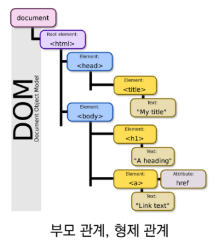
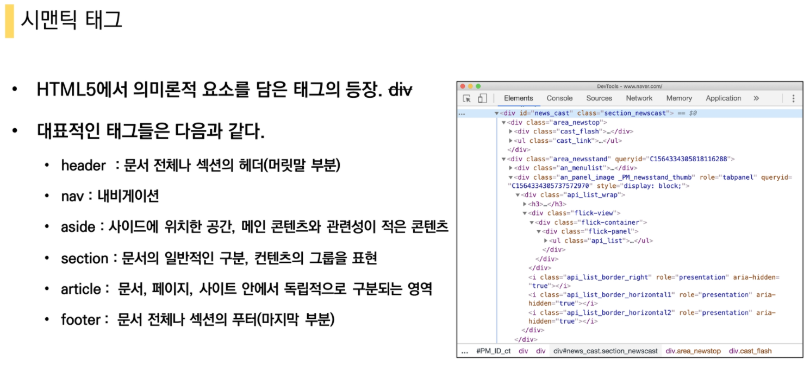
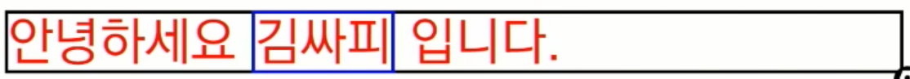
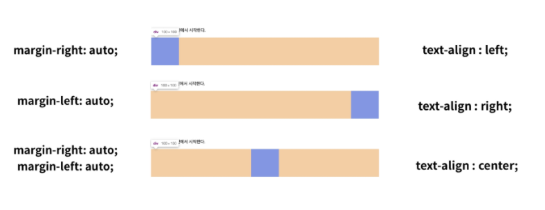
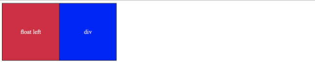
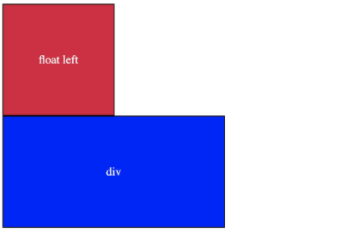
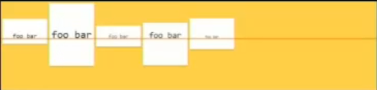
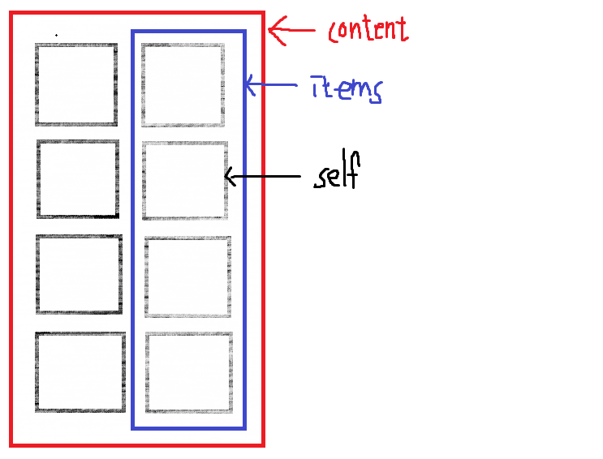
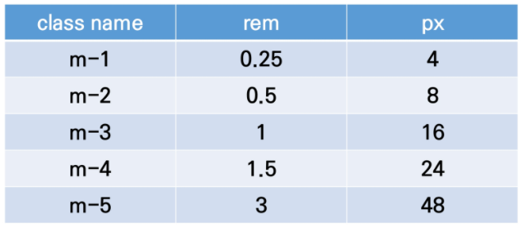
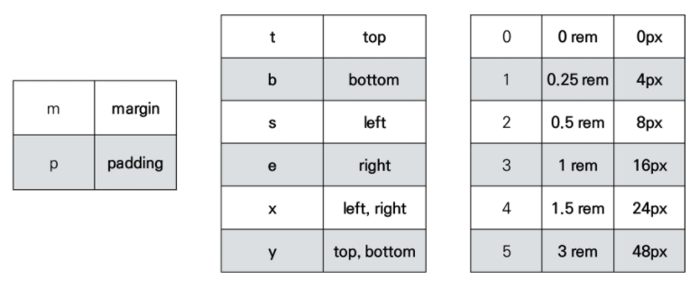

# Web

## HTML

### HTML 기본 구조

#### Hyper

: 텍스트 등의 정보가 동일 선상에 있는 것이 아니라 다중으로 연결되어 있는 상태.


#### Hyper Text

: 참조(하이퍼링크)를 통해 사용자가 한 문서에서 다른 문서로 즉시 접근할 수 있는 텍스트.


#### Markup language

- 태그 등을 이용하여 문서나 데이터의 구조를 명시하는 언어
- 프로그래밍 언어와는 다르게 단순하게 데이터를 포현하기만 한다.


#### HTML

- 웹 페이지를 작성하기 위한 언어
- 웹 컨텐츠의 의미와 구조를 정의


```html
<!DOCTYPE html>
<html lang="ko">
<head>
    <meta charset="UTF-8">
    <title>Document</title>
    </head>
<body>
    
</body>
</html>
```


#### html 요소

html 문서의 최상위 요소로 문서의 root를 뜻한다.


#### head 요소

문서 제목, 문자코드와 같이 해당 문서 정보를 담고 있으며, 브라우저에 나타나지 않는다.


#### body 요소

브라우저 화면에 나타나는 정보로 실제 내용에 해당한다.



#### DOM 트리

- DOM은 문서의 구조화된 표현을 제공하며, 프로그래밍 언어가 DOM구조에 접근할 수 있는 방법을 제공하여 그들이 문서 구조, 스타일 내용 등을 변경 할 수 있게 도움
- DOM은 동일한 문서를 표현하고, 저장하고, 조작하는 방법을 제공
- Web Page의 객체 지향 표현


#### 요소

```html
<h1> # (여는/시작) 태그
    HTML 요소는 태그와 내용으로 구성되어 있다.
</h1> # (닫는/종료) 태그
```

- HTML 요소는 시작 태그와 종료 태그 그리고 태그 사이에 위치한 내용으로 구성
  - 태그(Element)는 컨텐츠를 감싸는 것으로 그 정보의 성격과 의미를 정의
- 내용이 없는 태그들
  - br, hr, img, input, link, meta
- 요소는 중첩될 수 있음
  - 요소의 중첩을 통해 하나의 문서를 구조화
  - 여는 태그와 닫는 태그의 쌍을 잘 확인해야함
  - 오류를 반환하는 것이 아닌 그냥 레이아웃이 깨진 상태로 출력되기 때문에, 디버깅이 힘들어 질 수 있음


#### 속성

```html
<a href="https://google.com"></a>

태그별로 사용할 수 있는 속성은 다르다.
공백은 No!!!
url은 쌍따옴표로 사용
```

- 속성을 통해 태그의 부가적인 정보를 설정할 수 있음
- 요소는 속성을 가질 수 있으며, 경로나 크기와 같은 추가적인 정보를 제공
- 요소의 시작 태그에 작성하며 보통 이름과 값이 하나의 쌍으로 존재
- 태그와 상관없이 사용 가능한 속성들도 있음


### 시맨틱 태그




- 개발자 및 사용자 뿐만 아니라 검색엔진 등에 의미 있는 정보의 그룹을 태그로 표현
- 단순히 구역을 나누는 것 뿐만 아니라 '의미'를 가지는 태그들을 활용하기 위한 노력
- Non semantic 요소는 div, span 등이 있으며 h1, table 태그들도 시맨틱 태그로 볼 수 있음
- 요소의 의미가 명확해지기 때문에 코드의 가독성을 높이고 유지보수를 쉽게 함
- 검색엔진최적화(SEO)를 위해서 메타태그, 시맨틱 태그 등을 통한 마크업을 효과적으로 할 필요가 있다.


### 시맨틱 웹

( 별로 안 중요해 보임 )

- 웹 상에 존재하는 수많은 웹 페이지들에 메타데이터를 부여함
- 기존의 단순한 데이터의 집합이었던 웹 페이지를 '의미'와 '관련성'을 가지는 거대한 DB로 구축!


### HTML 문서 구조화

#### 그룹 컨텐츠

- **< p >**
- **< hr >**
- **< ol >**,  **< ul >**   # 리스트
  - < ol > : 순서가 있는 리스트
  - <  ul > : 순서가 없는 리스트
- **< pre >**,  **< blockquote >**
- **< div >**


#### 텍스트 관련 요소

- **< a >**
- **< b >**  vs  **< strong >**  :  모두 텍스트를 강조하는 역할
  - < b >  :  단순히 텍스트를 진하게 표시하는 역할만 한다.
  - < strong >  :  단순히 보여지는 강조가 아닌 실제로 페이지 내의 중요한 부분으로 부라우저에게
                           알리는 역할을 한다.
                           즉, 브라우저에서 지원되는 **웹 접근성**에 큰 기여를 한다.
- **< i >**  vs  **< em >**
  - < i >  :  단순히 텍스트를 기울이는 역할
  - < em >  :  실질적인 강조를 하며 텍스트를 기울임
- **< span >**.  **< br >**.  **< img >**
  - < span >  :  < div >와 같이 여러 개의 태그들을 묶어주는 주머니 역할이지만, inline 요소이다.
  - < br > : 텍스트 안에 줄바꿈 생성
  - < img > : 이미지 생성
- **기타 등등**


#### table

- < tr >, < td >, < th >
- < thead >, < tbody >, < tfoot >
- < caption >
- < col >, < colgroup > 등이 있다.


#### form

- < form >은 서버에서 처리될 데이터를 제공하는 역할을 한다.
- 기본 속성
  - action
  - method


#### input

- 다양한 타입을 가지는 입력 데이터 필드
- **< label >**  :  서식 입력 요소의 캡션
- < input > 의 공통 속성
  - **name, placeholder**
  - **required**
  - **autofocus**
- < input > 요소의 동작은 type에 따라 달라지므로,  각각의 내용을 숙지할 것!!


## CSS

### CSS 구문

스타일, 레이아웃 등을 통해 문서(HTML)를 표시하는 방법을 지정하는 언어

```css
h1 {
    color: blue;	/* 선언 */
    font-size: 15px;
    /*속성*/  : /*값*/
}
```

- CSS 구문은 선택자와 함께 열림
- 선택자를 통해 스타일을 지정할 HTML 요소를 선택
- 중괄호 안에서는 속성과 값, 하나의 쌍으로 이루어진 선언을 진행
- 각 쌍은 선택한 요소의 속성, 속성에 부여할 값을 의미.
  - 속성(Property) : 어떤 스타일 기능을 변경할 지 결정
  - 값(Value) : 어떻게 스타일 기능을 변경할 지 결정


#### CSS 정의 방법

1. 인라인(Inline)

   ```html
   <body>
   	<h1 style="color: blue; font-size: 100px;">Hello</h1>
   </body>
   ```

   해당 태그에 직접 `style` 속성을 활용


2. 내부 참조(embedding)  -  <style>

   ```html
   <head>
       <style>
           h1 {
               color: blue;
               font-size: 100px;
           }
       </style>
   </head>
   ```

   head 태그 내에 `<style>`에 지정


3. 외부 참조(link file) - 분리된 css 파일

   ```html
   <head>
       <link rel="stylesheet" href="mystyle.css">
   </head>
   ```

   ```css
   # mystyle.css  즉, css 새로운  파일 들고오기
   
   h1 {
       color:blue;
       font-size: 20px
   }
   ```

   

### CSS Selectors

- HTML 문서에서 특정한 요소를 선택하여 스타일링 하기 위해서는 반드시 선택자라는 개념이 필요

- 기본 선택자

  - 전체 선택자,  요소 선택자
  - 클래스 선택자,  아이디 선택자,  속성 선택자

  ##### 요소 선택자

  - HTML 태그를 직접 선택

  ##### 클래스 선택자

  - 마침표(.) 문자로 시작하며,  해당 클래스가 적용된 모든 항목을 선택

  ##### 아이디(id) 선택자

  - \# 문자로 시작하며, 해당 아이디가 적용된 모든 항목을 선택
  - 일반적으로 하나의 문서에 1번만 사용 (Unique)
  - 여러 번 사용해도 동작은 하지만, 단일 id를 사용하는 것을 권장 **

  

  #### CSS 적용 우선 순위

  1. 중요도(Importance)
     - `!important`	 :   이걸 통해 다른 요소들에게 큰 영향을 미쳐서 최대한 쓰지말자!!
  2.  우선 순위
     - 인라인  >  id 선택자  >  class 선택자, 속성 선택자  >  요소 선택자
  3.  소스 순서

  

#### QUIZ


색 맞추기

	1.   ?
	2.   ?
	3.   ?
	4.   ?
	5.   ?
	6.   ?
	7.   ?
	8.   ?


```
1 : orange(외부참조),  2 : blue(클래스),  3 : green(css에서 마지막에 선언된 green을 씀),
4 : green(3번과 마찬가지),  5 : red(id > class),  6 : darkviolet(!important),
7 : yellow(인라인 > id > class),   8 : darkviolet(!important > inline)
```


#### - 결합자

- 자손 결합자,  자식 결합자
- 일반 형제 결합자,  인접 형제 결합


- CSS는 상속을 통해 부모 요소의 속성을 자식에게 상속한다.

  - 속성(프로퍼티) 중에는 상속이 되는 것과 되지 않는 것들이 있다.

  - 상속 되는 것

    - ex ) Text 관련 요소,  opacity,  visibility 등

  - 상속 되지 않는 것

    - ex)  Boxmodel 관련 요소 (width, height, margin, padding, border, box-sizing, display)

      ​	    Position 관련 요소 (position, top/right/bottom/left,  z-index) 등

    ```html
    <body>
        <p>안녕하세요 <span>김싸피</span> 입니다. </p>
    </body>
    ```

    ```html
    <style>
        p {
            /* 상속됨 */
            color: red;
            /* 상속 안됨 */
            border: 1px solid black;
        }
        
        span {
            border: 1px solid blue;
        }
    </style>
    ```

    

    위와 같이 상속받지 않음을 알 수 있다.


### CSS 단위

- **px(픽셀)**

  - 모니터 해상도의 한 화소인 '픽셀'을 기준
  - 픽셀의 크기는 변하지 않기 때문에 고정적인 단위
  - 하지만 모니터의 해상도마다 달라져서 각각의 컴퓨터에서 각각 18px이라고 해도 다른 값을 가진다. **
  - 즉, 모두가 똑같이 보이는 단위는 아니다!!!!!!!

  

- **%**

  - 백분율 단위
  - 가변적인 레이아웃에서 자주 사용

  

- **em**

  - (바로 위, 부모 요소에 대한) 상속의 영향을 받음
  - 배수 단위, 요소에 지정된 사이즈에 상대적인 사이즈를 가짐.
  - ex)  부모요소 1.5em, 자식요소 1.5em으로 글자 크기 = 16px
  - -> 글자 크기는 16 * 1.5 * 1.5 => 36px이 된다.

  

- **rem**

  - (바로 위, 부모 요소에 대한) 상속의 영향을 받지 않음
  - 최상위 요소의 사이즈를 기준으로 배수 단위를 가짐.
  - ex) 부모요소 1.5em, 자식요소 1.5em, 글자 크기 = 16px
  - ->  글자 크기는 16 * 1.5 => 24px이 된다.

  

  ```html
  <style>
      .em {
          font-size: 1.5em;
      }
      .rem {
          font-size: 1.5rem;
      }
  </style>
  ```

  ```html
  <body>
      <ul class="em">
          <li class="em">1.5em</li>		<!-- 36px -->
          <li class="rem">1.5rem</li>		<!-- 24px -->
      </ul>
  </body>
  ```

  

  

- **viewport**

  - 웹 페이지를 방문한 유저에게 바로 보이게 되는 웹 컨텐츠의 영역
  - 주로 스마트폰이나 태블릿 디바이스의 화면을 일컫는 용어
  - 글자 그대로 디바이스의 viewport를 기준으로 상대적인 사이즈가 결정됨
  - vw, vh, vmin, vmax


#### 색상 단위

1. 색상 키워드

   - 대소문자를 구분하지 않음
   - red, blue, black과 같은 특정 색을 직접 글자로 나타냄

   

2. RGB 색상

   - 16진수 표기법 혹은 함수형 표기법을 사용해서 특정 색을 표현하는 방식
   - ex) '#' + 16진수 표기법
   - ex) rgb() 함수형 표기법

   

3. HSL 색상

   - 색상, 채도, 명도를 통해 특정 색을 표현하는 방식

**\*a는 alpha(투명도)가 추가된 것**

```css
p { color: rgba(0, 0, 0, 0.5); }
p { color: hsla(120, 100%, 0.5); }
```


### Selectors 심화

#### 자손 결합자

- selector A 하위의 모든 selector B 요소

  ```html
  <style>
    div span {
      color: red;
    }
  </style>
  
  <body>
    <div>
        <span>이견 빨강입니다.</span>
        <p>이건 빨강이 아닙니다.</p>
        <p>
          <span>이건 빨강입니다.</span>
        </p>
    </div>
  </body>
  ```

  이러면 body에 속하는 모든 <span> 태그를 빨강으로 지정


#### 자식 결합자

- selector A 바로 아래의 selector B 요소

  ```html
  <style>
    div > span {
      color: red;
    }
  </style>
  
  <body>
    <div>
        <span>이견 빨강입니다.</span>
        <p>이건 빨강이 아닙니다.</p>
        <p>
          <span>이건 빨강이 아닙니다.</span>
        </p>
    </div>
  </body>
  ```

  이러면 div 바로 아래에 있는 <span>만 빨강으로 바꾸고

  그 밑에 <p>안에 있는 <span>은 빨강으로 바꾸지 않는다.


#### 일반 형제 결합자

- selector A의 형제 요소 중 뒤에 위치하는 selector B 요소를 모두 선택

  ```html
  <style>
    p ~ span {
      color: red;
    }
  </style>
  
  <body>
    <span>p태그의 앞에 잇기 때문에 이건 빨강이 아닙니다.</span>
    <p>여기 문단이 있습니다.</p>
    <b>그리고 코드도 있습니다.</b>
    <span>p태그와 형제이기 때문에 이건 빨강입니다.</span>
    <b>더 많은 코드가 있습니다.</b>
    <span>이것도 p태그와 형제이기 때문에 빨강입니다.</span>
  </body>
  ```

  < p > 이후에 나오는 같은 라인에 존재하는 모든 <span>에 빨강색을 부여한다.

  


#### 인접 형제 결합자

- selector A의 형제 요소 중 바로 뒤에 위치하는 selector B 요소를 선택

  ```html
  <style>
    p + span {
      color: red;
    }
  </style>
  
  <body>
    <span>p태그의 앞에 잇기 때문에 이건 빨강이 아닙니다.</span>
    <p>여기 문단이 있습니다.</p>
    <span>p태그와 인접한 형제이기 때문에 이건 빨강입니다.</span>
    <b>더 많은 코드가 있습니다.</b>
    <span>p태그와 인접한 형제가 아니기 때문에 이건 빨강이 아닙니다.</span>
  </body>
  ```

  < p > 바로 뒤에 있는 같은 라인에 존재하는 <span> 하나만 빨강색으로 지정한다!!

  

### Box model

#### 네모 세상

- 모든 HTML 요소는 box 형태로 되어있음
- 하나의 박스는 네 부분(영역)으로 이루어짐
  - content  :  글이나 이미지 등 요소의 실제 내용
  - padding  :  테두리 안쪽의 내부 여백 요소에 적용된 배경색, 이미지는 padding 까지 적용
  - border  :  테두리 영역
  - margin  :  테두리 바깥의 외부 여백 배경색을 지정할 수 없다.


- margin: 10px  =>  상하좌우 10px
- margin:  10px  20px  =>  상하 10px  좌우 20px
- margin:  10px  20px  30px  =>  상 10px  좌우 20px  하 30px
- margin:  10px  20px  30px  40px  =>  상10px 좌20px 하30px  우40px


```css
.border {
    border-width: 2px;
    border-style: dashed;
    border-color: black;
}
```

위의 식을 더욱 간결하게 표현

```css
.border {
    border: 2px dashed black;
}
```

=> 2px, dashed, black의 요소를 지정함에 있어 순서는 상관없다!!


#### quiz

```html
<style>
    .box {
        width: 100px;
        margin: 10px auto;
        padding: 20px;
        border: 1px solid black;
        color: white;
        text-align: center;
        background-color: blueviolet;
    }
    
    .box-sizing {
        box-sizing: border-box;
        margin-top: 50px
    }
</style>
```

```html
<body>
    <div class="box">content-box</div>
    <div class="box box-sizing">border-box</div>
</body>
```

1. content-box의 width는 어떨까?
   - content: 100px + padding: 20px * 2 + border: 1px * 2  ==  142
2. border-box의 width는 어떨까?
   - border-box는 모두 합쳐서 box자체가 100px이 되도록 지정
   - 즉, content가 58px이 된다.


- box-sizing
  - 기본적으로 모든 요소의 `box-sizing`은 `content-box`
    - Padding을 제외한 순수 contents 영역만을 box로 지정
  - 다만, 우리가 일반적으로 영역을 볼 때는 border까지의 너비를 100px 보는 것을 원함
    - 그 경우, `box-sizing`을 `border-box`으로 설정


#### 마진 상쇄

: block A의 top과 block B의 bottom에 적용된 각각의 margin이 둘 중에서 큰 마진 값으로 결합되는 현상


### Display

#### CSS

모든 요소는 네모(박스모델)이고,  어떻게 보여지는지(display)에 따라 문서에서의 배치가 달라질 수 있다.


#### display

HTML 요소들을 시각적으로 어떻게 보여줄 지 결정하는 속성


#### 1. display : block

- 줄 바꿈이 일어나는 요소
- 화면 크기 전체의 가로 폭을 차지한다.
- 블록 레벨 요소 안에 인라인 레벨 요소가 들어갈 수 있다.
- 대표적인 블록 레벨 요소 :
  - div   /   ul,  ol,  li   /   p   /   hr   /   form 등


#### 2. display : inline

- 줄 바꿈이 일어나지 않는 행의 일부 요소
- content 너비만큼 가로 폭을 차지한다.
- width,  height,  margin-top,  margin-bottom을 지정할 수 없다.
- 상하 여백을 `line-height`로 지정한다.
- 대표적인 인라인 레벨 요소 :
  - span   /   a   /   img   /   input,  label   /   b,  em,  i,  strong 등


#### 속성에 따른 수평 정렬

​			**Block**의 정렬                                                                                                                   **Inline**의 정렬	



#### 3. display : inline-block

- block과 inline 레벨 요소의 특징을 모두 갖는다.
- inline처럼 한 줄에 표시 가능하며,
- block처럼 width,  height,  margin  속성을 모두 지정할 수 있다.


#### 4. display : none    ** hidden이랑 none 비교

- 해당 요소를 화면에 표시하지 않는다.  ( == 공간조차 사라진다. ) 
- 이와 비슷한 **visibility: hidden**은 해당 요소가 공간은 차지하나 화면에 표시만 하지 않는다.


### Position

- 문서 상에서 요소를 배치하는 방법을 지정한다.

- `static` : 모든 태그의 기본 값

  - 일반적인 요소의 배치 순서에 따름 (좌측 상단)
  - 부모 요소 내에서 배치도리 때는 부모 요소의 위치를 기준으로 배치 됨

- 아래의 좌표(top, bottom, left, right)를 사용하여 이동이 가능하다.  (음수 값도 가능) !!

- ex) top: 100px  =  위에서부터 아래로 100px 이동했다고 해석해야 한다!

  

  - `relative`

    - 자기 자신의 static 위치를 **기준**으로 이동
    - 레이아웃에서 요소가 차지하는 공간은 static일 때와 같음

    

  - `absolute`

    - 요소를 일반적인 문서 흐름에서 제거 후 레이아웃에 공간을 차지하지 않음
    - 즉, 다른 모든 것과 별개로 독자적인 곳에 놓임
    - 페이지의 다른 요소의 위치와 간섭하지 않는 격리된 사용자 인터페이스 기능을 만드는데 활용
      - 팝업 정보 상자, 제어 메뉴, 롤오버 패널, 페이지 어느 곳에서나 끌어서 놓기가 가능한 것들!
    - **static이 아닌 가장 가까이 있는 부모 / 조상 요소**를 기준으로 이동 (없는 경우 body에 붙는 형태 )
    - 즉, relative 또는 absolute인 부모요소의 좌상 꼭지점을 기준으로 이동한다!!

    

  - `fixed`

    - 요소를 일반적인 문서 흐름에서 제거 후 레이아웃에 공간을 차지하지 않음
    - 부모요소와 관계없이 **viewport**를 기준으로 이동
    - 스크롤 시에도 항상 같은 곳에 위치함


## CSS

### float

- 본래는 이미지 좌, 우측 주변으로 텍스트를 둘러싸는 레이아웃을 위해 도입
- 더 나아가 이미지가 아닌 다른 요소들에도 적용해 웹 사이트의 전체 레이아웃을 만드는데까지 발전


#### float 속성

- none  :  기본값
- left  :  요소를 왼쪽으로 띄움
- right  :  요소를 오른쪽으로 띄움

```css
.left {
    float: left;
}
```

- 즉,  한 요소가 정상 흐름으로부터 빠져 텍스트 및 **인라인 요소**가 그 주위를 감싸 요소의 좌, 우측을 따라 배치되어야 함을 지정

  

#### float clear

float를 지정해주었을 때 아래 많은 레이아웃들의 전체적인 구조가 망가지게 되는 현상을 방지하기 위한 작업

기본값은 inline이다.

```css
/* clearfix 다음에 가상요소 즉, 장식용 컨텐츠를 추가로 설정하겠다. */
.clearfix::after {
    content: "";
    display: block;  /* 기본값이 inline이라서 아래있는 요소들이 올라오지 못하도록 블락 지정!! */
    clear: both;   /* 선행 요소가 float가 됬음을 무시하겠다. */
}
```

```html
<header class="clearfix">	<!-- 부모에 지정 -->
	<div class="box1 left">float left</div>
</header>
<div class="box2">div</div>
```




#### Float 정리

flexbox 및 그리드 레이아웃과 같은 기술이 나오기 이전

- Float은 열 레이아웃을 만드는데 사용됨

이후

- 원래의 목표인 텍스트 블록 내에서 float 이미지를 위한 역할로 돌아감
  - Ex)  "legacy 레이아웃 기술"로 분류된다.
- 웹에서 여전히 사용하는 경우도 있음


### flexbox

#### CSS Flexible Box Layout

- 오랫동안 CSS Layout을 작성할 수 있는 도구는 float과 positioning 뿐이었다.
  - 문제가 있는 것은 아니었지만, 어떤 면에서는 제한적이고 한계가 있음
- Flexbox라 불리는 Flexible Box Module은 Flexbox 인터페이스 내의 아이템 간 "공간배분"과
  강력한 "정렬" 기능을 제공하기 위한 1차원 레이아웃 모델로 설계
- 요소 간 공간 배분과 정렬 기능을 위한 **1차원(단방향)** 레이아웃


- 요소
  - Flex Container (부모 요소)
  - Flex Item (자식 요소)
- 축
  - main axis (메인축)
  - cross axis (교차축)


#### Flex Container (부모 요소)

- display 속성을 flex 혹은 inline-flex로 지정
- flexbox 레이아웃을 형성하는 가장 기본적인 모델
- Flex Item들이 놓여있는 큰 영역


#### Flex Item (자식 요소)

- 컨테이너의 컨텐츠

- 자식들의 정렬은 자식들에게 각각 지정하는 것이 아니라 자식들을 감싸는 부모에 지정을 해줘야 한다!!  **


#### Flex에 적용하는 속성

- 배치 방향 설정 (메인축의 방향 = 상하좌우 정함)
  - `flex-direction`
    - 메인축 방향만 바꾼다.
    - 단방향 레이아웃이다!
    - row,  row-reverse,  column,  column-reverse


- 메인축 방향 정렬
  - `justify-content`  :  메인축 기준 여러 줄 정렬
    - flex-start  :  왼쪽부터 정렬
    - flex-end  :  오른쪽부터 정렬
    - space-between  :  좌우정렬
    - space-around  :  벽과 좌우간에는 각각의 items간의 간격의 반
    - space-evenly  :  벽과 좌우간에 간격 == 각각의 items간의 간격


- 교차축 방향 정렬

  - `align-items`  :  교차축 기준 한 줄 정렬

    - stretch  :  기본 정렬
    - flex-start  :  가장 위로 이동
    - flex-end  :  가장 아래로 이동

    - center  :  가운데 정렬
    - baseline  :  아래의 사진과 같이 글자 라인에 맞춰 너비, 높이가 다름

    

  -  `align-self`  :  교차축 기준 선택한 요소 하나 정렬

    - flex-start  :  교차축 기준 시작점
    - flex-end  :  교차축 기준 끝
    - center  :  교차축 기준 중앙점

  - `align-content`


- 기타

  - `flex-wrap` : 한 줄에 너무 많아서 초과됬을 때 **: wrap**을 지정 시 다음 줄로 넘어가게 지정된다.
    						**nowrap** : 강제로 한 줄로 표현
          **wrap-reverse**  :  넘쳤을 때 윗 줄로 넘어가게 지정
  - `flex-flow`

  ```css
  flex-flow: column wrap;		/* 열을 기준으로 정렬하면서 범위를 벗어나면 우측 다음줄로 넘김*/
  ```

  - `flex-grow`
    - 주축에서 남는 공간을 항목들에게 분배하는 방법
    - 각 아이템의 상대적 비율을 정하는 것은 아님
    - 기본 값  :  0
    - 음수 불가능
  - `order`
    - 작은 숫자 일수록 앞으로 이동
    - 기본 값  :  0





### bootstrap

#### CDN

- Content Delivery Network
- 컨텐츠를 효율적으로 전달하기 위해 여러 노드에 가진 네트워크에 데이터를 제공하는 시스템



```css
.mx-auto {	/* 수평 중앙 정렬 */
    margin-right: auto !important;
    margin-left: auto !important;
}
```

```css
.py-0 {   /* 수직 중앙 정렬 */
    padding-top: 0 !important;
    padding-bottom: 0 !important;
}
```




#### Bootstrap

```html
<div class="d-flex justify-content-start">...</div>
<div class="d-flex align-items-start">...</div>
```


### Responsive web

- 반응형 웹은 별도의 기술 이름이 아닌 웹 디자인에 대한 접근 방식, 반응형 레이아웃 작성에 도움이 되는 사례들의 모음 등을 기술하는데 사용하는 용어


#### Grid system

- Bootstrap Grid system은 flexbox으로 제작됨
- `container`, `rows`, `column`으로 컨텐츠를 배치하고 정렬
- 반드시 기억해야 할 2가지!
  - 12개의 column
  - 6개의 grid breakpoints


