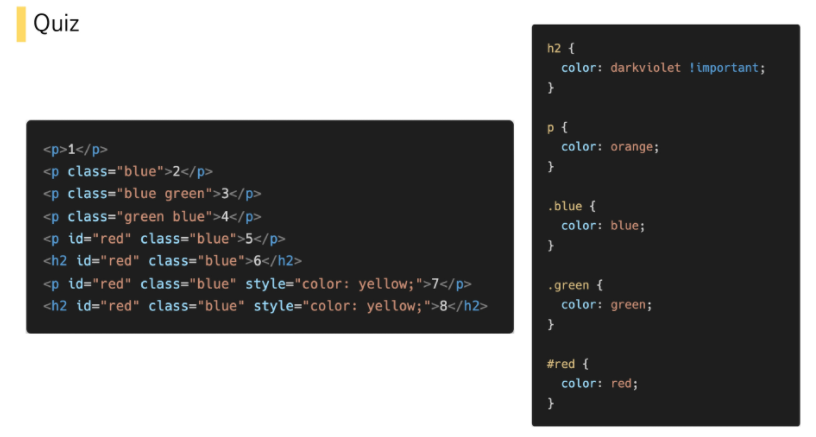
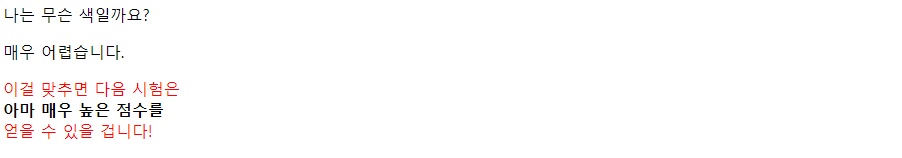

# Web

## HTML

1. head의 요소는 브라우저에 나타난다 or 나타나지 않는다.

   

   

2. DOM트리가 뭐냐?  


3. HTML에서 사용되는 모든 요소는 시작태그와 종료태그가 필요하다?

   필요하지 않는 요소 ex)  br, input, hr


4. 요소는 중첩될 수 있다?

   


5. 오류가 발생했다. ==> 결과에 오류가 반환이 되냐?

   


6. 

```html
<a href="https://google.com"></a>
```

> 1. `<a href="https://google.com"></a> `: ?
> 2. `href="https://google.com"` : ?
> 3. `<a>` : ?

​	


7. 시맨틱 태그에서 문서, 페이지, 사이트 안에서 독립적으로 구분되는 영역인 태그?

   

   

8. 시맨틱 태그에서 문서의 일반적인 구분, 컨텐츠의 그룹을 표현하는 영역인 태그?


9. < h1 > ,   < table > 태그는 시맨틱 태그로 볼 수 있다?


10. 다음 빈칸에 넣으세요.

    <result>

    - Home
    - Web
    - Help

    <solution>

    ```html
    <div>
      <?>Home</?>
      <?>Web</?>
      <?>Help</?>
    </div>
    ```

    ? : 

    


11. `<b>(=<i>)` 와 `<strong>(=<em>)`의 차이점에 대하여 서술하시오.


12. `<div>`와 `<span>`의 가장 큰 차이점은?


13. form 의 기본 속성 2가지를 적으세요.

    


14. 다음 빈칸을 채워 넣으세요.

```html
<div>
  <? for="name">이름을 기재해주세요.</?><br>
  <input type="text" id="name" name="name" autofocus>
</div>
```


## CSS

15. 

```css
h1 {
    color: blue;
    font-size: 15px;
}
```

> 1. `color: blue;`: ?
> 2. `font-size` : ?
> 3. `15px` : ?


16. [class 선택자, 요소 선택자, 인라인, 소스순서, !important, id 선택자]의 우선순위를 적으시오


17. 

색 맞추기

	1.   ?
	2.   ?
	3.   ?
	4.   ?
	5.   ?
	6.   ?
	7.   ?
	8.   ?


18. 옳은 것을 골라라

    1. 모든 속성은 상속이 가능하다.
    2. visibility는 상속이 되지 않는다.
    3. position은 상속이 된다.
    4. width, height는 상속이 되지 않는다.
    5. color는 상속이 되지 않는다.

    


19. px은 고정적인 단위이기 때문에 해상도를 24px로 지정이 되어있다면 모든 컴퓨터에서 같은 값을 가진다.

    


20. 다음 빈칸을 채워 넣으세요.

```css
<style>
    .em {
        font-size: 1.5em;
    }
    .rem {
        font-size: 1.5rem;
    }
</style>
```

```html
<body>
    <ul class="em">
        <li class="em">1.5em</li>
        <li class="rem">1.5rem</li>
        <li>no class</li>
    </ul>
</body>
```

1.5em의 픽셀의 크기 : (          )

1.5rem의 픽셀의 크기 : (          )

no class의 픽셀의 크기 : (          )


21. 색상을 지정함에 있어서 대소문자의 구분은 존재 한다?

    


22. 정답을 고르세요.

    <result>

    

    ```html
    <body>
      <span> 나는 무슨 색일까요? </span>
      <p>매우 어렵습니다.</p>
      <span> 이걸 맞추면 다음 시험은 </span><br>
      <b> 아마 매우 높은 점수를 </b><br>
      <span> 얻을 수 있을 겁니다! </span><br>
    </body>
    ```

    

    1. ```css
       <style>
         p span {
           color: red;
         }
       </style>
       ```

    2. ```css
       <style>
         p > span {
           color: red;
         }
       </style>
       ```

    3. ```css
       <style>
         p ~ span {
           color: red;
         }
       </style>
       ```

    4. ```css
       <style>
         p + span {
           color: red;
         }
       </style>
       ```


23. 아래의 코드가 지정하는 값으로 옳은 것을 고르시오.

```css
.margin {
    margin: 10px 20px 30px;
}
```

	1. 상 : 10px,  하 : 10px,  좌 : 20px, 우 :  30px
	2. 상 : 10px,  하 : 10px,  좌 : 30px, 우 :  20px
	3. 상 : 20px,  하 : 20px,  좌 : 10px, 우 :  30px
	4. 상 : 20px,  하 : 20px,  좌 : 30px, 우 :  10px
	5. 상 : 10px,  하 : 30px,  좌 : 20px, 우 :  20px
	6. 상 : 30px,  하 : 10px,  좌 : 20px, 우 :  20px


24. 옳지 않은 것을 고르시오.

    1. block 요소 안에 inline 요소가 들어갈 수 있다.
    2. div / ul, ol 등은 block 요소에 속한다.
    3. span, img, input 등은 inline 요소에 속한다.
    4. inline 요소에도 width, height 등을 지정할 수 있다. 
    5. block의 정렬은 margin-left(or right) : auto를 사용하고,
       inline의 정렬은 text-align : left(right, center)를 사용한다.

    


25. ?에 들어갈 값은

```css
. box{
    ?:?;
}
```

box는 눈에 보이지도 않으면서 공간을 차지한다.


26. float를 지정해주었을 때 아래 많은 레이아웃들의 전체적인 구조가 망가지게 되는 현상을 방지하기 위한 작업?

    


27. Flexbox에 대한 설명으로 옳지 않은것은?

    1. 요소는 부모요소와 자식요소를 제외하고 더 존재한다.
    2. 축은 메인축과 교차축으로만 이루어져있다.
    3. 요소 간 공간 배분과 정렬 기능을 위한 1차원 레이아웃이다.
    4. 부모 요소는 flex 혹은 inline-flex로 지정한다.

    


28. flex-direction과 flex-wrap을 같이 쓸 수 있는 속성을 적으시오.

    


29. 현재 박스의 위치가 마음에 들지 않는다. 그래서 나는 마진을 새로 지정을 해주고 싶다.
    현재 위치가 default값일 때 현재 위치에서 위 아래에 동시에 16px의 크기만큼 마진을 주고 싶을 때 
    붓스트랩 클래스는?
    
    


